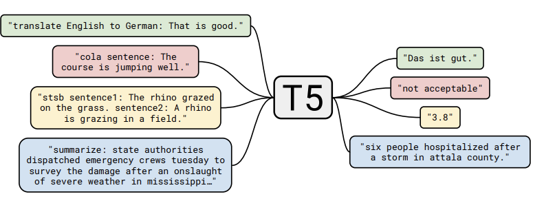

<p align="center">
  
</p>


<h3 align="center">
    <p>Brain-T5: A lightweight model fine-tuned for simplifying medical jargon using FLAN-T5 and LoRA.</p>
</h3>

Brain-T5 is a lightweight language model designed to translate technical clinical and biomedical text into layperson summaries so non-experts can understand them. Built on top of FLAN-T5 using LoRA fine-tuning, it is deployable on consumer grade GPUs and acts to assist research into medical fields from outer disciplines and acts as an assistant for patient communication. This repository includes full training, evaluation and inference pipelines, from dataset intake to an interactive chat mode.

## Table of Contents
- Brain-T5
  - [Project Motivation](#project-motivation)
  - [Features](#features)
  - [Project Structure](#project-structure)
  - [Installation](#installation)
  - [Training Usage](#training-usage)
  - [Chat Usage](#chat-usage)
  - [Training Results](#training-results)
- The FLAN-T5 Model
  - [What is FLAN-T5?](#what-is-flan-t5)
  - [Why not other models?](#why-not-other-models)

## Project Motivation:
Between medical professionals and the average person or researcher in an outer discipline, the scope of what "standard language" is does not cross over very well. Jargon is used excessively inside the medical world which may cause outer folk to struggle to understand basic summaries, research abstracts/results, or diagnostic reports. The only tools that exist that fit this use case effectively are large language models such as OpenAI's GPT-3+, Google's Gemini, Anthropic's Sonnet and others, however they cannot be localised easily on consumer grade hardware and use inputted conversational data to train their models. Many medical institutions may not want their data to cross borders, making a local option preferrable.

Brain-T5 aims to close this gap by:

- Using a fine-tuning approach with LoRA to an existing reliable text model
- Using the lightweight T5 model from Hugging Face trained on reliable medical summarisations. 
- Using an open source, easy-to-install model that can be used on average consumer-grade hardware.

Brain-T5 is a major step toward bridging the gap between the average person and medical knowledge and aims to enhance both clinical practices and interdisciplinary research around the world.

## Features:
* **LoRA-based fine-tuning** - train large models on consumer-grade GPUs.
* **Supports HuggingFace datasets, CSV, JSON** - flexible with data types.
* **Built-in ROUGE evaluation** - automatic scoring after each training epoch.
* **Interactive Chat CLI(`chat.py`)** - real-time inference like a medical assistant.
* **Modular codebase** - easy to extend or adapt to alternative domains (legal, finance, etc.)

## Project Structure
```
├── train.py          # Full training pipeline with metrics and logging
├── predict.py        # Batch inference on JSONL or single text
├── chat.py           # Interactive CLI for conversational testing
├── modules.py        # Tokeniser/model loaders and LoRA attachment
├── dataset.py        # Dataset wrapper and fast collator
├── runs/             # LoRA adapters & metrics saved here
└── README.md
```

## Installation:

```
# First, clone the repository and at the same time, checkout the topic-recognition branch.
git clone -b topic-recognition https://github.com/TPGCIG/PatternAnalysis-2025/

# Change directory to the Brain-T5 one.
cd recognition/Project13-TristanGreen

# Install the dependencies.
pip install -r requirements.txt
```

You're now ready to go!

## Training Usage

### 1) Prepare data
Supports **JSONL**, **CSV**, or the **BioLaySumm HF dataset**.
- **JSONL** (one object per line) — default columns: `report` (input), `summary` (target)
  ```json
  {"report": "CT scan shows...", "summary": "The scan shows..."}
  {"report": "Patient presents with...", "summary": "In plain English..."}
  ```
- **CSV** (has headers): `report,summary,...`

### 2) Quick-start commands
Pick ONE of these, then iterate.

**A. Local JSONL**
```bash
python train.py   --train_source local_jsonl --train_path train.jsonl   --val_source   local_jsonl --val_path   val.jsonl   --output_dir runs/flan_t5_base_lora_myexp   --batch_size 1 --accum 16 --epochs 3 --lr 2e-4 --fp16
```

**B. Local CSV**
```bash
python train.py   --train_source local_csv --train_path train.csv   --val_source   local_csv --val_path   val.csv   --input_col report --target_col summary   --output_dir runs/flan_t5_base_lora_csv   --batch_size 1 --accum 16 --epochs 3 --lr 2e-4 --fp16
```

**C. Hugging Face (BioLaySumm)**
> Requires `pip install datasets`. Uses the built-in dataset loader.  
> `--train_path`/`--val_path` are **split names** (e.g., `train`, `validation`, `test`).
```bash
python train.py   --train_source hf --train_path train   --val_source   hf --val_path validation   --output_dir runs/flan_t5_base_lora_biolaysumm   --batch_size 1 --accum 16 --epochs 3 --lr 2e-4 --fp16
```

### 3) What the script actually does
- Builds tokenizer + datasets via `make_datasets(...)` with your chosen **source kind** (`local_jsonl`, `local_csv`, or `hf`) and columns (`--input_col`, `--target_col`).  
- Attaches **LoRA** adapters to FLAN‑T5 and trains with AdamW + cosine schedule.  
- Evaluates with **ROUGE** at epoch end (and optionally mid‑epoch with `--eval_every_steps`).  
- Saves best adapters + tokenizer to `--output_dir`, along with `metrics.json` and `train_log.csv`.
If you don’t see these files, you didn’t train anything meaningful.

### 4) Arguments
- **Data**: `--train_source/--train_path`, `--val_source/--val_path`, `--input_col`, `--target_col`
- **Sequence lengths**: `--max_input_len`, `--max_target_len` (truncate aggressively if OOM)
- **Batching**: `--batch_size`, `--accum` (effective batch = batch_size × accum)
- **Optim**: `--lr`, `--weight_decay`, `--warmup_steps`, `--clip`
- **LoRA**: `--lora_r`, `--lora_alpha`, `--lora_dropout`
- **Eval**: `--eval_batch_size`, `--eval_max_new_tokens`, `--eval_beams`, `--eval_every_steps`
- **Misc**: `--epochs`, `--seed`, `--fp16`

### 5) Outputs (verify or it didn’t happen)
Inside your `--output_dir`:
```
runs/<name>/
├── adapter_config.json
├── adapter_model.bin        # LoRA weights
├── tokenizer.json
├── metrics.json             # best ROUGE
└── train_log.csv            # step-wise loss
```
You should also see console logs like:
```
[epoch 1] train_loss=...
[epoch 1] ROUGE: {'rouge1': ..., 'rouge2': ..., 'rougeL': ..., 'rougeLsum': ...}
```

### 6) Use the trained adapters
Single text:
```bash
python predict.py --adapter_dir runs/<name> --text "Put clinical text here" --fp16
```
Batch JSONL:
```bash
python predict.py --adapter_dir runs/<name> --jsonl dev.jsonl --input_col report --out_path predictions.jsonl
```

### 7) General usage tips 
- If CUDA OOM: lower `--max_input_len`/`--max_target_len`, increase `--accum`, or drop `--fp16` if your GPU cannot handle the defaults.
- If ROUGE is flat, your data columns are probably wrong. Print a few samples.
- If `runs/<name>` is empty, you never beat your previous best—check learning rate and dataset.

## Chat Usage:

### Examples
> This sample was trained on 3 epochs over a 16 hour period, better results can come as result of longer training and adjustable parameters. The rouge scores for this training are seen in [Training Usage](#training-usage)

You: “CT angiography shows ~70% stenosis of the proximal LAD; plan for PCI if symptoms persist despite maximal medical therapy.”
Model: “There’s a notable blockage in a main heart artery. The team suggests a procedure if medicines don’t help enough.”

You: “MRI brain: multiple periventricular T2/FLAIR hyperintensities suggestive of demyelination; correlate clinically for MS.”
Model: “Scans show several spots in brain areas often linked to nerve coating problems. Doctors will compare this with symptoms.”

You: “HbA1c 9.2% despite metformin 1g BID; initiate basal insulin 10u qHS and titrate to fasting 5–7 mmol/L.”
Model: “Blood sugar control isn’t good with current meds. Start a nightly insulin dose and adjust to get morning sugars into a better range.”

You: “Echo: LVEF 35%, global hypokinesis, mild MR; optimize GDMT—ACEi/ARB, beta-blocker, MRA.”
Model: “Heart pumping is weaker than normal with some valve leak. Use standard lung medicines to improve function.”

### Error Analysis
The model consistently drops critical figures (example 1: ~70%, example 3: 9.2%) and summarises the responses with shallow descriptions that lose a lot of meaning. This is likely since, while T5 uses attention out-of-the-box, it doesn't learn to prioritise clinically critical details like these ones. This is likely since we are fine-tuning the model that is fundamentally trained on the [Common Crawl](https://commoncrawl.org/) dataset which does not prioritise numeric values or risk markers. In downstream fine-tuning, the model should be explicitly taught that figures have substantial meaning and should be valued more than other tokens that the model processes which the Common Crawl dataset is trained to do.

The model also hallucinates (rarely though) (example 4: *use standard lung medicines* in heart context) and can forget the context loosely. This is obviously problematic but in downstream fine-tuning, the model should be explicitly over-attentive to the context as mistakes of this nature can cause problems in the medical field.  
These limitations, while problematic, can be overcome via training on consumer grade hardware. Also, under proper supervision from a medical professional, these bugs can be quickly identified and flagged.


## Training Resuts:

After the first epoch, the following results were achieved:

[epoch 1] train_loss=1.3393<br>
[epoch 1] ROUGE: {'rouge1': 0.639758940949706, 'rouge2': 0.4262667182806449, 'rougeL': 0.5793631565756041, 'rougeLsum': 0.5795225947980385}

# The FLAN-T5 Model
## What is T5?
T5 (Text-to-Text Transfer Transformer) is a transformer model built completely on a text-to-text framework. This framework treats every task in Natural Language Processing (NLP), whether it be machine translation, summarisation, or question-answering, as a process of taking text as input and producing text as output. This unification allows the same model architecture, objective function, and training procedure to be applied across all tasks, massively simplifying the entire NLP training pipeline.


The super summarised explanation on how the model works (provided by OpenAI's ChatGPT) is:

> This is the quoted text from ChatGPT.

1. Tokenise → Embed → + Position. Words become vectors, add position info so the model knows order.
2. Encoder (repeated N×):
   - Self-attention: each word looks at all other words to decide what matters.
   - Feed-forward: a per-token mini-MLP to transform features.
   - Add & Norm: residual skip + layer norm to keep training stable. <br>Output = contextual vectors for every input token.

3. Decoder input: start with <pad>/<bos> and previously generated tokens shifted right.
4. Decoder block (repeated N×):
   - Masked self-attention: looks only at past output tokens (mask stops peeking at the future).
   - Cross-attention: queries the encoder outputs so the decoder can “look up” relevant parts of the input.
   - Feed-forward and Add & Norm again.

5. Linear → Softmax: turn the decoder’s last vector into a probability over the vocabulary; pick the next token; loop 4–5 until done.

> End quote.



This is a representation of how T5 unifies all forms of text-to-text input/output to heavily generalise its use case and simply learning.

## What is FLAN-T5?
FLAN-T5 (Fine-tuned LAnguate Net T5) is an enhanced version of the original [T5](https://medium.com/analytics-vidhya/t5-a-detailed-explanation-a0ac9bc53e51) but fine-tuned using a technique called instruction tuning.
During training, FLAN-T5 is exposed to a massive number of tasks that are all formatted as natural language instructions (e.g. "Answer the following question: ..."). This training paradigm significantly improves the model's ability to:

1. **Follow instructions** since it is built on user prompts instead of general text data.
2, **Generalise** since the training prompts may map a new, prompted task out for the model to answer which can help it understand how to answer newer tasks it previously couldnt.


