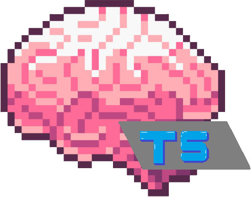

<p align="center">
  
</p>


<h3 align="center">
    <p>Brain-T5: A lightweight model fine-tuned for simplifying medical jargon using FLAN-T5 and LoRA.</p>
</h3>

Brain-T5 is a lightweight language model designed to translate technical clinical and biomedical text into layperson summaries so non-experts can understand them. Built on top of FLAN-T5 using LoRA fine-tuning, it is deployable on consumer grade GPUs and acts to assist research into medical fields from outer disciplines and acts as an assistant for patient communication. This repository includes full training, evaluation and inference pipelines, from dataset intake to an interactive chat mode.

## Project Motivation:
Between medical professionals and the average person or researcher in an outer discipline, the scope of what "standard language" is does not cross over very well. Jargon is used excessively inside the medical world which may cause outer folk to struggle to understand basic summaries, research abstracts/results, or diagnostic reports. The only tools that exist that fit this use case effectively are large language models such as OpenAI's GPT-3+, Google's Gemini, Anthropic's Sonnet and others, however they cannot be localised easily on consumer grade hardware and use inputted conversational data to train their models. Many medical institutions may not want their data to cross borders, making a local option preferrable.

Brain-T5 aims to close this gap by:

- Using a fine-tuning approach with LoRA to an existing reliable text model
- Using the lightweight T5 model from Hugging Face trained on reliable medical summarisations. 
- Using an open source, easy-to-install model that can be used on average consumer-grade hardware.

Brain-T5 is a major step toward bridging the gap between the average person and medical knowledge and aims to enhance both clinical practices and interdisciplinary research around the world.

## Features:
- **LoRA-based fine-tuning** - train large models on consumer-grade GPUs.
- **Supports HuggingFace datasets, CSV, JSON** - flexible with data types.
- **Built-in ROUGE evaluation** - automatic scoring after each training epoch.
- **Interactive Chat CLI(`chat.py`)** - real-time inference like a medical assistant.
- **Modular codebase** - easy to extend or adapt to alternative domains (legal, finance, etc.)

## Project Structure
```
├── train.py          # Full training pipeline with metrics and logging
├── predict.py        # Batch inference on JSONL or single text
├── chat.py           # Interactive CLI for conversational testing
├── modules.py        # Tokeniser/model loaders and LoRA attachment
├── dataset.py        # Dataset wrapper and fast collator
├── runs/             # LoRA adapters & metrics saved here
└── README.md
```

## Demo Examples:


## Installation:

```
# First, clone the repository and at the same time, checkout the topic-recognition branch.
git clone -b topic-recognition https://github.com/TPGCIG/PatternAnalysis-2025/

# Change directory to the Brain-T5 one.
cd recognition/Project13-TristanGreen

# Install the dependencies.
pip install -r requirements.txt
```

You're now ready to go!

## Training Usage:
The user has complete control over the training parameters, model used (in this circumstance, the user may want to train on `flan-t5-small`, `flan-t5-base`, `flan-t5-large`, `flan-t5-xl`, and `flan-t5-xxl`, however the default is set to `flan-t5-base` as it nets reliable results on consumer grade GPUs.

## Training Usage

### 1) Prepare data
Supports **JSONL**, **CSV**, or the **BioLaySumm HF dataset**.
- **JSONL** (one object per line) — default columns: `report` (input), `summary` (target)
  ```json
  {"report": "CT scan shows...", "summary": "The scan shows..."}
  {"report": "Patient presents with...", "summary": "In plain English..."}
  ```
- **CSV** (has headers): `report,summary,...`

### 2) Quick-start commands
Pick ONE of these, then iterate.

**A. Local JSONL**
```bash
python train.py   --train_source local_jsonl --train_path train.jsonl   --val_source   local_jsonl --val_path   val.jsonl   --output_dir runs/flan_t5_base_lora_myexp   --batch_size 1 --accum 16 --epochs 3 --lr 2e-4 --fp16
```

**B. Local CSV**
```bash
python train.py   --train_source local_csv --train_path train.csv   --val_source   local_csv --val_path   val.csv   --input_col report --target_col summary   --output_dir runs/flan_t5_base_lora_csv   --batch_size 1 --accum 16 --epochs 3 --lr 2e-4 --fp16
```

**C. Hugging Face (BioLaySumm)**
> Requires `pip install datasets`. Uses the built-in dataset loader.  
> `--train_path`/`--val_path` are **split names** (e.g., `train`, `validation`, `test`).
```bash
python train.py   --train_source hf --train_path train   --val_source   hf --val_path validation   --output_dir runs/flan_t5_base_lora_biolaysumm   --batch_size 1 --accum 16 --epochs 3 --lr 2e-4 --fp16
```

### 3) What the script actually does
- Builds tokenizer + datasets via `make_datasets(...)` with your chosen **source kind** (`local_jsonl`, `local_csv`, or `hf`) and columns (`--input_col`, `--target_col`).  
- Attaches **LoRA** adapters to FLAN‑T5 and trains with AdamW + cosine schedule.  
- Evaluates with **ROUGE** at epoch end (and optionally mid‑epoch with `--eval_every_steps`).  
- Saves best adapters + tokenizer to `--output_dir`, along with `metrics.json` and `train_log.csv`.
If you don’t see these files, you didn’t train anything meaningful.

### 4) Arguments
- **Data**: `--train_source/--train_path`, `--val_source/--val_path`, `--input_col`, `--target_col`
- **Sequence lengths**: `--max_input_len`, `--max_target_len` (truncate aggressively if OOM)
- **Batching**: `--batch_size`, `--accum` (effective batch = batch_size × accum)
- **Optim**: `--lr`, `--weight_decay`, `--warmup_steps`, `--clip`
- **LoRA**: `--lora_r`, `--lora_alpha`, `--lora_dropout`
- **Eval**: `--eval_batch_size`, `--eval_max_new_tokens`, `--eval_beams`, `--eval_every_steps`
- **Misc**: `--epochs`, `--seed`, `--fp16`

### 5) Outputs (verify or it didn’t happen)
Inside your `--output_dir`:
```
runs/<name>/
├── adapter_config.json
├── adapter_model.bin        # LoRA weights
├── tokenizer.json
├── metrics.json             # best ROUGE
└── train_log.csv            # step-wise loss
```
You should also see console logs like:
```
[epoch 1] train_loss=...
[epoch 1] ROUGE: {'rouge1': ..., 'rouge2': ..., 'rougeL': ..., 'rougeLsum': ...}
```

### 6) Use the trained adapters
Single text:
```bash
python predict.py --adapter_dir runs/<name> --text "Put clinical text here" --fp16
```
Batch JSONL:
```bash
python predict.py --adapter_dir runs/<name> --jsonl dev.jsonl --input_col report --out_path predictions.jsonl
```

### 7) General usage tips 
- If CUDA OOM: lower `--max_input_len`/`--max_target_len`, increase `--accum`, or drop `--fp16` if your GPU cannot handle the defaults.
- If ROUGE is flat, your data columns are probably wrong. Print a few samples.
- If `runs/<name>` is empty, you never beat your previous best—check learning rate and dataset.


## Chat Usage:


## Training Resuts:

[epoch 1] train_loss=1.3393
[epoch 1] ROUGE: {'rouge1': 0.639758940949706, 'rouge2': 0.4262667182806449, 'rougeL': 0.5793631565756041, 'rougeLsum': 0.5795225947980385}


